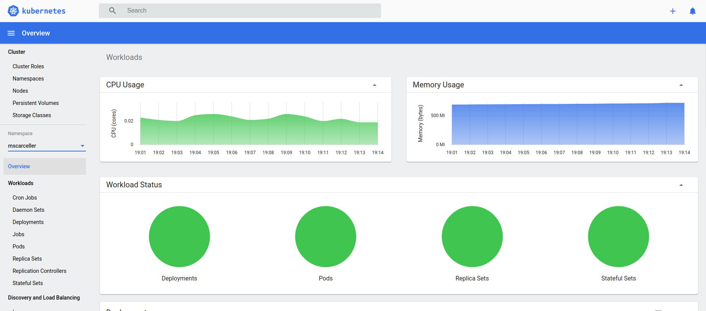
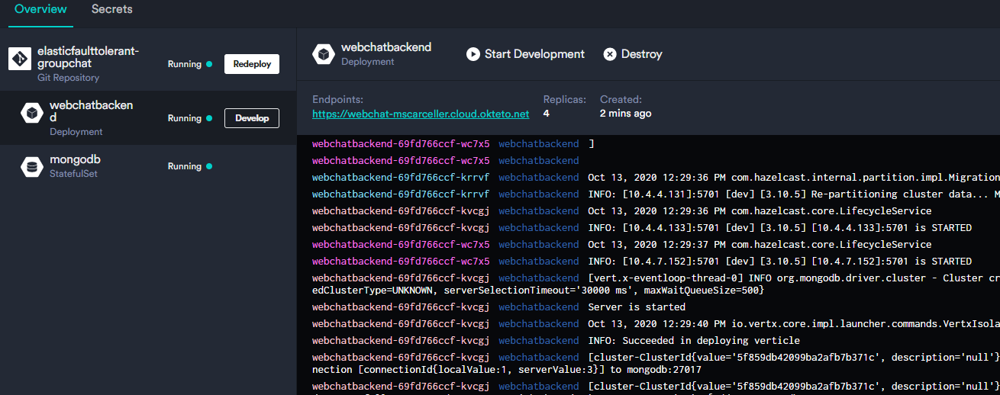

# Getting Started


1. [Deploy on local Kubernetes](#kubernetes)
2. [Deploy on Okteto Cloud](#okteto)
3. [Deploy Sample Angular front application](#front)
4. [Usage Messages Library](#messagelib)

<a name="kubernetes"></a>

## 1. Deploy on local Kubernetes

* ####  Setting up Kubernetes with Minikube

First of all you need is a Kubernetes cluster available on your computer. In this tutorial we're going to use Minikube on Ubuntu. You can find how to install it in this link https://kubernetes.io/docs/tasks/tools/install-minikube/

Once you have Minikube installed on you computer start it and check its status:

```shell
> minikube start
```

The output is similar to this:

```shell
minikube v1.11.0 en Ubuntu 18.04
Using the docker driver based on existing profile
Starting control plane node minikube in cluster minikube
Restarting existing docker container for "minikube" ...
Setting up Kubernetes v1.18.3 en Docker 19.03.2...
kubeadm.pod-network-cidr=10.244.0.0/16
Verifying Kubernetes components...
Enabled addons: dashboard, default-storageclass,
```

Then you can check minikube status:

```shell
> minikube status
```


- #### Enable Metric Server

The scalability/elasticity of the application , as mentioned in previous sections, is based on HPA,  and metrics-server monitoring needs to be deployed in the cluster to provide metrics via the resource metrics API, because HPA uses this API to collect metrics.

To install it on Minikube:

```shell
> minikube addons enable metrics-server
```

And you have an output like this:

```shell
> metrics-server was successfully enabled
```


- #### Deploy the application

Inside k8s folder type next command:

```shell
> kubectl apply -f ./backend_k8s.yaml 
```

You will show an output like this:

```
namespace/mscarceller created
configmap/eftgca-backvertx-configmap created
secret/webchat-secrets created
service/mongodb created
statefulset.apps/mongodb created
ingress.extensions/webchat-ingress created
service/webchatservice created
service/webchat created
horizontalpodautoscaler.autoscaling/webchat-consumer created
deployment.apps/webchatbackend created
```


- #### Monitoring the resources

In order to check the status of all the components deployed inside the cluster you can use the next command:

```
> watch -n 1 kubectl get pods,services,deployments,ingress --namespace=mscarceller
```

And you'll see something like this:

```shell
NAME                                  READY   STATUS    RESTARTS   AGE
pod/mongodb-0                         1/1     Running   0          75s
pod/webchatbackend-5579777b5c-lxz8f   1/1     Running   0          60s
pod/webchatbackend-5579777b5c-p8ndk   1/1     Running   0          75s

NAME                          TYPE           CLUSTER-IP      EXTERNAL-IP   PORT(S)          AGE
service/mongodb               ClusterIP      None            <none>        <none>           75s
service/webchat               LoadBalancer   10.97.123.130   <pending>     8080:31737/TCP   75s
service/webchatservice        ClusterIP      None            <none>        5701/TCP         75s

NAME                             READY   UP-TO-DATE   AVAILABLE   AGE
deployment.apps/webchatbackend   2/2     2            2           75s

NAME                                 CLASS    HOSTS                                  ADDRESS      PORTS   AGE
ingress.extensions/webchat-ingress   <none>   webchat-mscarceller.cloud.okteto.net   172.17.0.2   80      75s
```


- #### Checking Metric-Server

To check if the metric server is measuring correctly our resources you can obtain its details:

```
> kubectl describe hpa webchat-consumer --namespace=mscarceller
```

The output:

```
Name:                                                  webchat-consumer
Namespace:                                             mscarceller
Labels:                                                <none>
Annotations:                                           CreationTimestamp:  Fri, 09 Oct 2020 18:35:18 +0200
Reference:                                             Deployment/webchatbackend
Metrics:                                               ( current / target )
  resource cpu on pods  (as a percentage of request):  5% (10m) / 75%
Min replicas:                                          2
Max replicas:                                          10
Deployment pods:                                       2 current / 2 desired
Conditions:
  Type            Status  Reason            Message

----            ------  ------            -------

  AbleToScale     True    ReadyForNewScale  recommended size matches current size
  ScalingActive   True    ValidMetricFound  the HPA was able to successfully calculate a replica count from cpu resource utilization (percentage of request)
  ScalingLimited  True    TooFewReplicas    the desired replica count is less than the minimum replica count
Events:
  Type     Reason                        Age                From                       Message

----     ------                        ----               ----                       -------

  Normal   SuccessfulRescale             19m                horizontal-pod-autoscaler  New size: 2; reason: Current number of replicas below Spec.MinReplicas
```


- #### Using the Kubernetes Dashboard

To access the [Kubernetes Dashboard](https://kubernetes.io/docs/tasks/access-application-cluster/web-ui-dashboard/), run this commands in a shell after starting Minikube to install the addon and get the address:

Install the dashboard Addon:

```
> minikube dashboard
```

Get the address:

```shell
> minikube dashboard
Verifying dashboard health ...
🚀  Launching proxy ...
🤔  Verifying proxy health ...
🎉  Opening http://127.0.0.1:46399/api/v1/namespaces/kubernetes-dashboard/services/http:kubernetes-dashboard:/proxy/ in your default browser...
```

it will launch the browser:



**NOTE**: to get the access token you can use this command:

```
> kubectl -n kube-system describe secret $(kubectl -n kube-system get secret | awk '/^deployment-controller-token-/{print $1}') | awk '$1=="token:"{print $2}'
```


- #### Edit the Local Hosts File

When you type a domain name in your browser to go to a website, your computer translates the domain name your typed into an IP address and connect to the server that hosts the website. We have deploy an Ingress Service, so to access the application in our browser we need to configure the local host file to redirect the traffic to our minikube cluster.

The definition of our ingress service is:

```yaml
apiVersion: extensions/v1beta1
kind: Ingress
metadata:
  name: webchat-ingress
  namespace: mscarceller
  annotations:
    kubernetes.io/ingress.class: "nginx"
spec:
  rules:
  - host: webchat-mscarceller.cloud.okteto.net
    http:
      paths:
        - path: /
          backend:
            serviceName: webchatfrontservice      
            servicePort: 8081
        - path: /chat
          backend:
            serviceName: webchat      
            servicePort: 8080
```

We need to redirect *webchat-mscarceller.cloud.okteto.net* traffic to the ip of our ingress service exposed by minikube

**NOTE**: we have Ingress configuration ready to deploy a front application on port 8081

First get the ingress IP:

```
> watch -n 1 kubectl get ingress --namespace=mscarceller
```

We get something like this:

```
NAME              CLASS    HOSTS                                  ADDRESS      PORTS   AGE
webchat-ingress   <none>   webchat-mscarceller.cloud.okteto.net   172.17.0.2   80      50m
```

So we need to edit our our Hosts file:

```
> sudo nano /etc/hosts
```

A similar lines below should appear in the file.

```
127.0.0.1       localhost
127.0.1.1       migle-portatil

# The following lines are desirable for IPv6 capable hosts
::1     ip6-localhost ip6-loopback
fe00::0 ip6-localnet
ff00::0 ip6-mcastprefix
ff02::1 ip6-allnodes
ff02::2 ip6-allrouters
```

We have to add next line:

```
172.17.0.2      webchat-mscarceller.cloud.okteto.net
```

Save the file. Changes you make to the hosts file take effect immediately.

Now you can reach the application and connect to websocket at *webchat-mscarceller.cloud.okteto.net/chat*

---
<a name="okteto"></a>

## 2. Deploy on Okteto Cloud

[Okteto Cloud](https://cloud.okteto.com/#/?origin=docs) gives access to  Kubernetes namespaces to enable developers to code, build, and run Kubernetes applications entirely in the cloud.

First of all is to configure your cli tool for developing your applications in Okteto Cloud. Follow the steps in this link:

[Configure CLI Okteto Cloud](https://okteto.com/docs/cloud/credentials)

Then you can deploy the application in the same way as you do on you local Kubernetes

```
> kubectl apply -f ./backend_k8s.yaml
```

Once you have your cli tool configured to use with Okteto you can use the same commands viewed previously.

You can also visit Okteto cloud dashboard and see something like this:



---
<a name="front"></a>
## 3. Deploy Sample Angular front application

First of all you need is to deploy a back-end instance of the chat application, on your local Kubernetes or on Okteto cloud. Then run next command inside k8s folder:

```
> kubectl apply -f ./frontend_k8s.yaml 
```

And you'll see something like this:

```shell
service/webchatfrontservice created
deployment.apps/webchatfront created
```

Now you can open the application in your browser at https://webchat-mscarceller.cloud.okteto.net/

**NOTE**: Remember to edit the Local Hosts File if you deploy on local Kubernetes


---

<a name="messagelib"></a>

## 4. Usage Message Library

Please, visit the [Elastic & FaultTolerant GroupChat Application Messages Lib](../EFTGCA-MessagesLib/README.md) project.