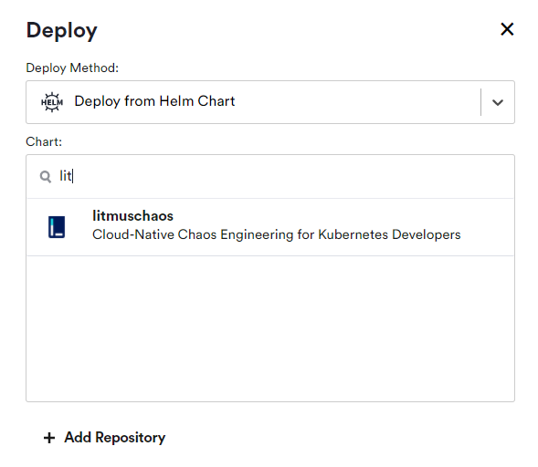
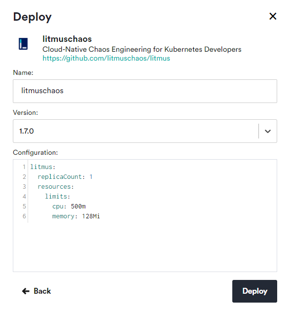
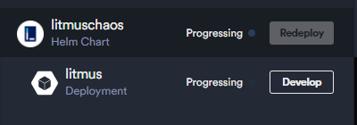

# Chaos Testing with Litmus and Okteto Cloud

## Deploy Chaos Testing Environment:

First step is to configure the enviroment, all the necesary elements for start chaos testing. You can choose to do it form this repo or to do it manually.

### Option 1: Deploy form repository

You can just click on the link below and deploy your chaos-ready development environment:

[Set Chaos Testing Enviroment on Okteto](https://cloud.okteto.com/deploy?repository=https://github.com/MasterCloudApps-Projects/ElasticFaultTolerant-GroupChat)

This will automatically deploy the following resources on your Okteto Cloud account:

* The Litmus Chaos operator, from the Okteto catalog
* The pod-delete chaos experiment

### Option 2: Deploy manually

You can always manually install every component by hand:

Log in to [Okteto Cloud](https://cloud.okteto.com/), and click on the Deploy button on the top left. A deploy dialog will open. Switch the deploy method to Deploy from Helm Chart and select "litmuschaos" Chart:

<div style="text-align:center">



</div>

Then you customize the configuration values. Once you're ready, click on the Deploy button on the bottom of the dialog to deploy your Helm release.

<div style="text-align:center">



</div>

When you click on Deploy, Okteto Cloud will launch an installation job for you directly in the cluster. The installation job is in charge of executing the required helm commands to deploy your Helm Chart.

As soon as your Helm release is deployed, you'll see its state in the UI. 

<div style="text-align:center">



</div>

More info about deploying applications from hel charts on Okteto here:

https://okteto.com/docs/cloud/deploy-from-helm

## Configure your CLI Tools to use Okteto

First of all is to configure your cli tool for developing your applications in Okteto Cloud. Follow the steps in this link:

[Configure CLI Okteto Cloud](https://okteto.com/docs/cloud/credentials)

## Start Chaos Testing:


```
> kubectl apply -f k8s/experiment.yaml
> kubectl apply -f k8s/engine.yaml
```