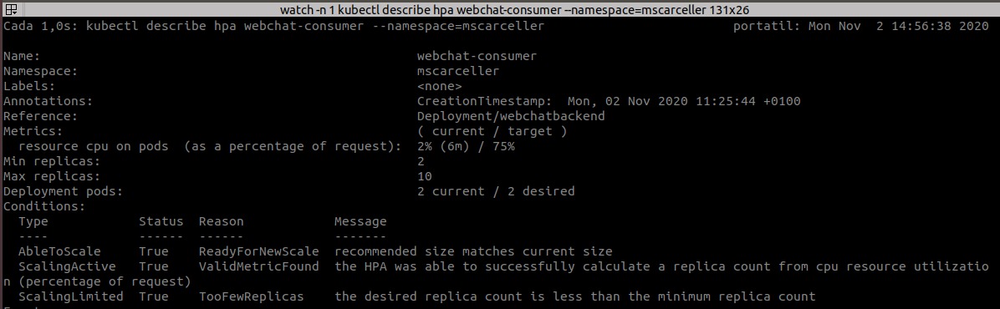
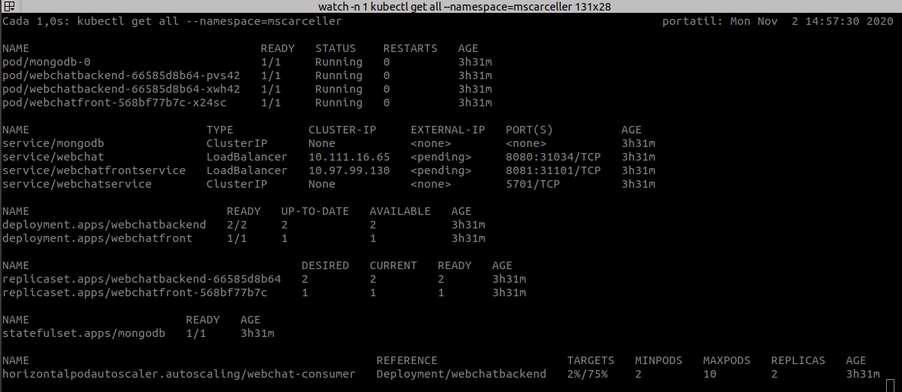
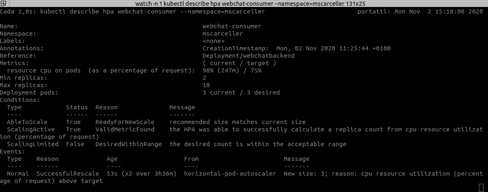
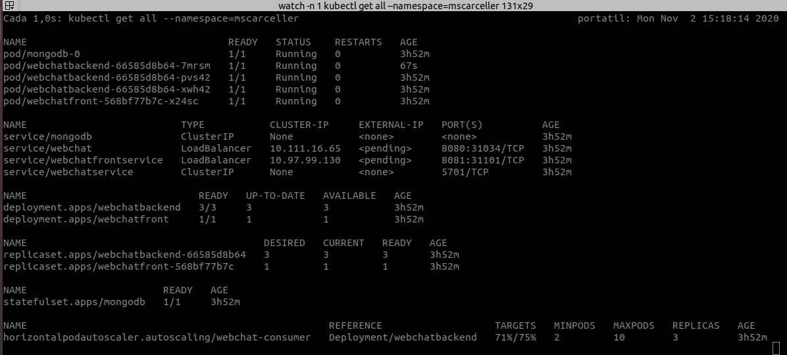
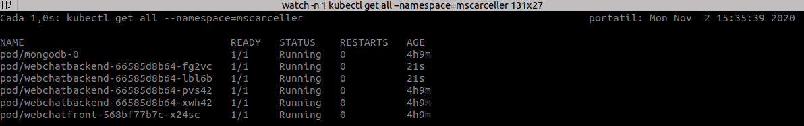
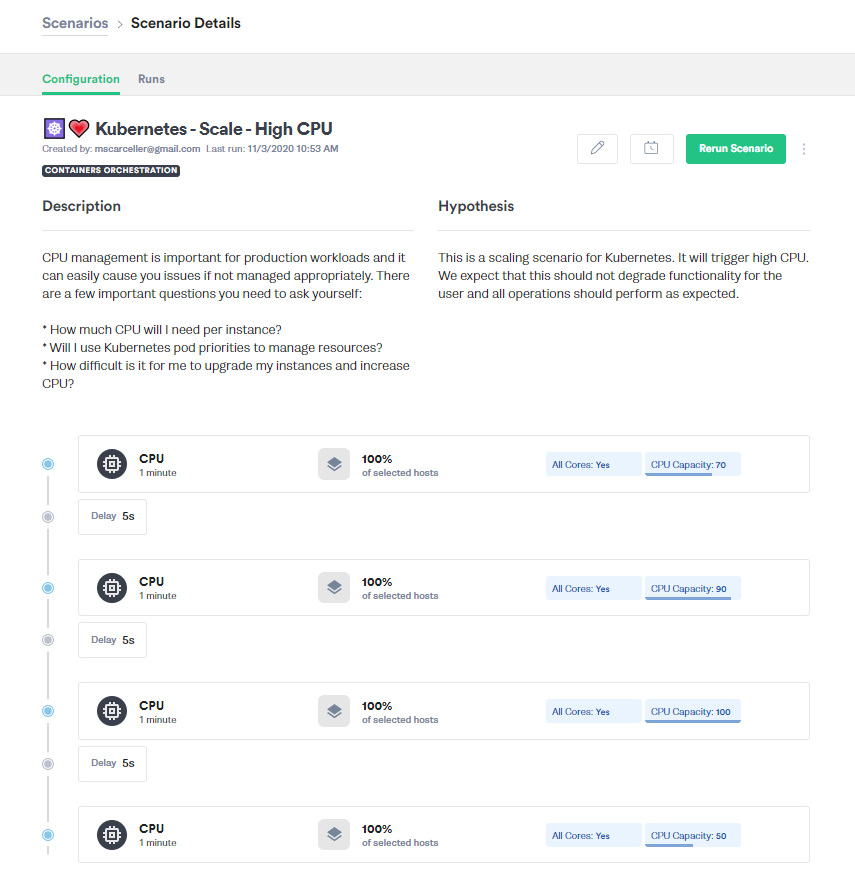
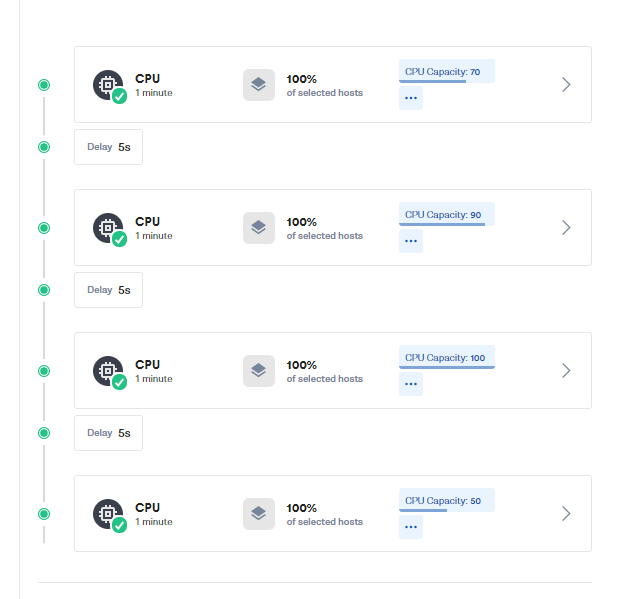
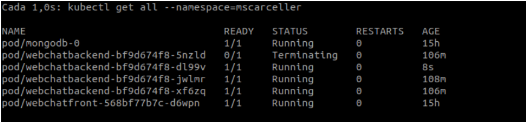

# Elastic & Fault Tolerant GroupChat Application Tests

Javascript module for testing the Elastic & FaultTolerant GroupChat Application based on VertX


1. [Load Test: testing the elasticity](#loadtest)

   1. [Custom script for load testing](#load1)
   2. [Load testing with Gremlin](#load2)

2. [Chaos: testing the fault tolerance](#caos)

   

<a name="loadtest"></a>

## 1. Load test: testing elasticity.


**Load testing** is simply creating the capability to CPU management, that is important for production workloads and it can easily cause you issues if not managed appropriately.

We have implemented two different ways to make this kind of test, using a custom script, that also validate than any message is missed, and using [Gremlin](https://www.gremlin.com/).

<a name="load1"></a>

 #### 1. Custom script for load testing

This is a load test. We use a node script that initialize 10 users and performs a loop of text messages sending. 

To show the HPA state we use the next command:

```
> watch -n 15 kubectl describe hpa webchat-consumer --namespace=mscarceller
```

And show something like this:



There are two important points:

```
AbleToScale     True    ReadyForNewScale  recommended size matches current size
```

```
ScalingActive   True    ValidMetricFound  the HPA was able to successfully calculate a replica count from cpu resource utilizatio
n (percentage of request)
```


To show the Deployment state we use the next command:

```
> watch -n 1 kubectl get all --namespace=mscarceller
```

And show something like this, we can see the 2 backend pods.



 Then  start the test:

```
> node index.js
Inizializating test with 10 users sending 50 messages
Now users are chatting, please wait...
```

During the test we can see how the HPA increase the number of Pods. When the load exceed the limit the HP<C instantiate a new Pod, in order to decrease the load: 



We can see the message:

```
Normal  SuccessfulRescale  31m (x2 over 4h7m)   horizontal-pod-autoscaler  New size: 3; reason: cpu resource utilization (percentage of request) above target
```

We also can see the 3 pods running:



It increase until 4 pods.



When the test finish and the load decrease, the HPA gracefully kills the unnecessary pods.


```
  Normal  SuccessfulRescale  31m (x2 over 4h7m)   horizontal-pod-autoscaler  New size: 3; reason: cpu resource utilization (percentage of request) above target
  Normal  SuccessfulRescale  13m (x2 over 4h6m)   horizontal-pod-autoscaler  New size: 4; reason: cpu resource utilization (percentage of request) above target
  Normal  SuccessfulRescale  6m22s                horizontal-pod-autoscaler  New size: 3; reason: All metrics below target
  Normal  SuccessfulRescale  78s (x3 over 3h58m)  horizontal-pod-autoscaler  New size: 2; reason: All metrics below target

```


This is the test result:

```shell
> node index.js
Inizializating test with 10 users sending 50 messages
Now users are chatting, please wait...
Waiting for results, please wait...
************************************
INFO FOR USER: UserName 1
Messages sent: 461
Messages pending: 0
************************************
************************************
INFO FOR USER: UserName 2
Messages sent: 461
Messages pending: 0
************************************
************************************
INFO FOR USER: UserName 3
Messages sent: 461
Messages pending: 0
************************************
************************************
INFO FOR USER: UserName 4
Messages sent: 461
Messages pending: 0
************************************
************************************
INFO FOR USER: UserName 5
Messages sent: 461
Messages pending: 0
************************************
************************************
INFO FOR USER: UserName 6
Messages sent: 461
Messages pending: 0
************************************
************************************
INFO FOR USER: UserName 7
Messages sent: 461
Messages pending: 0
************************************
************************************
INFO FOR USER: UserName 8
Messages sent: 461
Messages pending: 0
************************************
************************************
INFO FOR USER: UserName 9
Messages sent: 461
Messages pending: 0
************************************
************************************
Total users reconnections: 0
************************************
Test Finished
```

Any message has been lost.


<a name="load2"></a>

 #### 2. Load testing with Gremlin

Gremlin must be installed on each host you wish to attack. In order for your hosts (and containers within the hosts) to be targetable, the installed gremlin must be registered with the Gremlin Control Plane. Visit https://www.gremlin.com/docs/infrastructure-layer/installation/ to setup the Gremlin environment on your system.

Once all is configured have defined a scaling scenario:



This is a scaling scenario for Kubernetes. It will trigger high CPU. We expect that this should not degrade functionality for the user and all operations should perform as expected.  

During the test we can inspect how the HPA scale the pods:

Initial state: 2 backend pods

```shell
NAME                                  READY   STATUS    RESTARTS   AGE
pod/mongodb-0                         1/1     Running   0          70s
pod/webchatbackend-7b47dbcfb4-czbtb   1/1     Running   0          11s
pod/webchatbackend-7b47dbcfb4-zlm6w   1/1     Running   0          27s
pod/webchatfront-68f48d5bd7-btrl6     1/1     Running   0          69s
```

Then Gremlin increase the load, and the HPA scale the cluster:

```shell
  Normal   SuccessfulRescale             3m7s                   horizontal-pod-autoscaler  New size: 4; reason: cpu resource utilization (percentage of request) above target
```

```
NAME                                  READY   STATUS    RESTARTS   AGE
pod/mongodb-0                         1/1     Running   0          7m19s
pod/webchatbackend-7b47dbcfb4-2k6qq   1/1     Running   0          64s
pod/webchatbackend-7b47dbcfb4-8jd78   1/1     Running   0          103s
pod/webchatbackend-7b47dbcfb4-gf2w2   1/1     Running   0          49s
pod/webchatbackend-7b47dbcfb4-z6mx7   1/1     Running   0          2m52s
pod/webchatfront-68f48d5bd7-btrl6     1/1     Running   0          7m18s
```

When the scenario finish we can observe how the cpu load decrease:

```
Metrics:                                               ( current / target )
  resource cpu on pods  (as a percentage of request):  4% (9m) / 75%
```

And the HPA scale down the cluster, in two intervals, due to the last step in the scenario:

```
Normal   SuccessfulRescale        36m                horizontal-pod-autoscaler  New size: 3; reason: All metrics below target
Normal   SuccessfulRescale        35m                horizontal-pod-autoscaler  New size: 2; reason: All metrics below target
```

And finally we have the initial state again:

```
NAME                                  READY   STATUS    RESTARTS   AGE
pod/mongodb-0                         1/1     Running   0          21m
pod/webchatbackend-7b47dbcfb4-8jd78   1/1     Running   0          15m
pod/webchatbackend-7b47dbcfb4-z6mx7   1/1     Running   0          17m
pod/webchatfront-68f48d5bd7-btrl6     1/1     Running   0          21m
```

The scenario result:




---

<a name="caos"></a>

## 2. Chaos: Testing the fault tolerance.

**Chaos testing** is simply creating the capability to continuously, but randomly, cause failures in your production system. This practice is meant to **test** the resiliency of the systems, the fault tolerance of our application.

We have implemented two different ways to make this kind of test, according with the way you choose for deploy the backend: local or cloud deployment:

- Set up chaos testing for **local deployment**: please, visit the [Docker Pod Chaos](https://github.com/MasterCloudApps-Projects/ElasticFaultTolerant-GroupChat/blob/master/EFTGCA-VertxAppTests/Docker-Pod-Chaos/README.md) document.
- Set up chaos testing for **cloud deployment**: please, visit the [Chaos Testing with Litmus and Okteto Cloud](https://github.com/MasterCloudApps-Projects/ElasticFaultTolerant-GroupChat/blob/master/EFTGCA-VertxAppTests/ChaosTestingOkteto.md) document.


Once the chaos is started we can see how the pods are killed:




Once you have setup your chaos system and you have your backend pods been killed periodically you can run the tests:

```
> node .\test_chaos.js
```

This script create some users and execute a loop, sending messages to the server and processing it, during the tests some pods will be killed.

The result output will be something like this:

```
Inizializating test with 9 users sending 50 messages
Now users are chatting, please wait...
Waiting for results, please wait...
************************************
INFO FOR USER: UserName 1
Messages sent: 441
Messages pending: 0
************************************
************************************
INFO FOR USER: UserName 2
Messages sent: 441
Messages pending: 0
************************************
************************************
INFO FOR USER: UserName 3
Messages sent: 441
Messages pending: 0
************************************
************************************
INFO FOR USER: UserName 4
Messages sent: 441
Messages pending: 0
************************************
************************************
INFO FOR USER: UserName 5
Messages sent: 441
Messages pending: 0
************************************
************************************
INFO FOR USER: UserName 6
Messages sent: 441
Messages pending: 0
************************************
************************************
INFO FOR USER: UserName 7
Messages sent: 441
Messages pending: 0
************************************
************************************
INFO FOR USER: UserName 8
Messages sent: 441
Messages pending: 0
************************************
************************************
INFO FOR USER: UserName 9
Messages sent: 441
Messages pending: 0
************************************
************************************
Total users reconnections: 7
************************************

Test Finished
```

In this example we can observe the number of necessary reconnections (7), and also the fact that there isn't messages lost