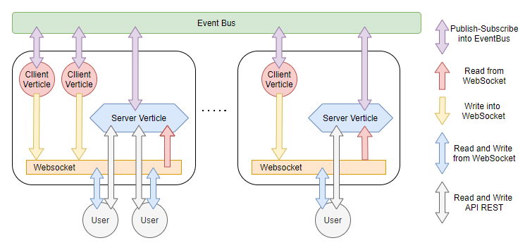

# Elastic & FaultTolerant GroupChat Application - Vert.x based Application


1. [Introduction](#intro)

2. [Application description](#description)

3. [Kubernetes architecture elements](#k8s) 

4. [Building and publish the image into DockerHub](#build)

5. [Packaging the application](#packaging) 

6. [Running the application](#running)

   

<a name="intro"></a>
## 1. Introduction

This repository contains all the necessary code for deploy an elastic, fault Tolerant chat application. 
The application is based on [Vert.x](https://vertx.io/) Framework. Vert.x is an open source, reactive  software development toolkit from the developers of Eclipse.


Each pod contains an instance of our application. It creates a server verticle at start, that is listening for websocket users connections. When an user send a valid ***joinRoom*** request the server verticle instantiate a client verticle and register into a event bus (for more information about Vert.x event bus visit this [link](https://vertx.io/docs/vertx-core/java/#event_bus)) .

So, when an user send a message to the application, the server publish it into the event bus, and all the clients, that are subscribed to it, receive the message and sent it to the users through the websocket. 

The Map that contains all the clients information is shared between the server verticle in different pods using a Hazelcast cluster.

All the messages are stored and persisted into a shared mongoDB instance. Form more information about mongoDB client in Vert.x visit this [link](https://vertx.io/docs/vertx-mongo-client/java/).

All of this elements are deploy on a Kubernetes cluster and all are described in the next sections.


---
<a name="description"></a>

## 2. Application Description

This chapter describes the basic elements and processes in the application, such load config, login process o messages sending:

The basic structure of the backend application is:



Each node has a server verticle instance. This server verticle expose and listen for incoming users request. When a valid join request is received the server verticle create a new Client verticle and subscribe it to the event bus.

When an user send a new message through the websocket the server publish it into the Event Bus, and all the clients subscribed to it can get it and send to their users writing it into the websocket.

When an user send an image message through the API Rest (Post action) the server process it like a text message and send an notification to the other users using the event bus. When the clients receive this notification claim for the image using the API Rest (GET action) and download the image message.

When an user send an file message through the API Rest (Post action) the server process it like a image message and send the messages to the other users with the name and unique identifier of the file. The users can download the file through an API Rest endpoint exposed by the server or through an specific function provided by the messages library.


- #### First of all: loading Application config.

  As the backend is deployed over Kubernetes we use the Kubernetes config map (see [Kubernetes architecture elements](#k8s) section), that  can be loaded with Vert.x with this code:

```java
		//config store options for retrive the config option setted in K8s manifest 
		ConfigStoreOptions store = new ConfigStoreOptions()
            .setType("configmap")
            .setConfig(new JsonObject()
                .put("namespace", "mscarceller")
                .put("name", "eftgca-backvertx-configmap")
            );
    
        ConfigRetriever retriever = ConfigRetriever.create(vertx, new ConfigRetrieverOptions().addStore(store));

        retriever.getConfig(ar -> {
            if (ar.failed()) {
                System.out.println("Error retriving configuration properties");
            } else {
              JsonObject config = ar.result();
              this.maxMessagesHistory = config.getInteger("maxMessagesHistory");
            }
        });
```

In order to be able to do this kind of config retrieve from the application in a Pod is necessary to set a Role inside the cluster, also described in the [Kubernetes architecture elements](#k8s) section.


- #### Create a Hazelcast Cluster for users:

In order to share the users connected between all the backend instances we use a Hazelcast cluster:

```java
    // Setting and init shared webchatClients Map
    Set<HazelcastInstance> instances = Hazelcast.getAllHazelcastInstances();
    HazelcastInstance hz = instances.stream().findFirst().get();
    webChatClients = hz.getMap("users");
```


- #### Create a DB instance to persist the messages:

```java
   JsonObject mongoconfig = new JsonObject().put("connection_string", "mongodb://mongodb:27017").put("db_name","webchat")
   mongoDBclient = MongoClient.createShared(vertx, mongoconfig, "WebchatDBPool");
```

​		**NOTE**:  we use *"mongodb://mongodb:27017"* where second *mongodb* is the name of the kubernetes node for our mongodb instance.


- #### **Subscribe the server to EventBus:**

The server need to be subscribed to some events into the event bus:

```java
// Listen for disconected users event
   vertx.eventBus().consumer("delete.user", data -> {
      JsonObject userData = new JsonObject(data.body().toString());
      System.out.println("Someone has notified for deleting user");
      deleteClient(userData.getString("roomName"),userData.getString("userId"));
   });

// Listen for reconnect users of a destroyed pod
   vertx.eventBus().consumer("reconnect.users", data -> {
       System.out.println("Someone has notified in EventBus that is shutting down...");
   });

// Listen for new servers in cluster
   vertx.eventBus().consumer("new.server", data -> {
       System.out.println("New server available");
   });
```


* #### **Prepare server for shutting down**

When a node is going to shutdown (because a scale-down), the server publish an event into the event bus to request the users to reconncet to another instance. This is made by using hooks:

```java
	Runtime.getRuntime().addShutdownHook(new Thread() {
                @Override
                public void run() {
                    Request reconnectRequest = new Request(Method.RECONNECT.getDescription(),null, getNewId());
                    System.out.println("I'm shutting down.");
                    vertx.eventBus().publish("reconnect.users", "");
                    serverWebSocket.writeFinalTextFrame(reconnectRequest.toString());
                    System.out.println("Shutting down notify in event bus. Someone reconnect my users");
                }
            });
```


* #### Connect to server:

  First of all is the establishment of a websocket connection between the client and the server. Our server verticle is ready for incoming connections at "/chat" path:

  ```java
  // Init the websocket handler
          server.webSocketHandler((serverWebSocket) -> {
              if (serverWebSocket.path().equals("/chat")) {
              ...
  ```

  

- #### Register user and join into a chat room:

  The basic flow for register an user and join into room is described in the next images:

  <p align="center">
      
  </p>
  
  The user send a ***joinRoom*** message, that contains the userId, userName and roomName. The server verticle checks if the userId is already registered and if is the case it reconnect the user again. If the userId isn't registered yet the server check the userName, because two users can't join the room with the same userName. If the userName already exists in the room the server responds to the user with an error message.
  
  
  
  

<p align="center">
    
</p>
​		When all this conditions are satisfied, the server register the user creating a client verticle and subscribing it into the event 		bus as a consumer:

```java
	private void startClient(Vertx vertx) {
        // Listen for messages from his chat
        this.handler = vertx.eventBus().consumer(this.room).handler(data -> {
            try{
                // Try to send the message
                System.out.println("Reading message from event bus: " + data.body().toString());
                serverWebSocket.writeFinalTextFrame(data.body().toString());
                System.out.println("Writing to socket: " + "Server response to:" + data.body().toString());
            }catch(IllegalStateException e){
                // The user is offline, so I delete it.
                vertx.eventBus().publish("delete.user", "{\"roomName\":\""+this.room+"\",\"userId\":\""+this.id+"\"}");
                this.handler.unregister();
            } 
        });
    }
```


* #### Sending and receiving text messages:

  As we have mentioned above, when an user send a message to the application, the server publish it into the event bus, and all the clients, that are subscribed to it, consume the message and sent it to the users through the websocket. 

  The basic flow:

  <p align="center">
    
  </p>


* #### Sending and receiving image messages:

  As we have mentioned above, when an user send a image message to the application, in order to not collapse the websocket the library really send the message through an API rest published by the server. It get the message with the base64 image string and store into the MongoDB and send a message to the other users using the Event Bus in the same way that it does with text messages. When the clients, receive this kind of messages claim for the image through the API Rest.

  The basic flow:

  

<p align="center">
  
</p>


* #### Sending and receiving file messages:

  When an user send a file message to the application, in order to not collapse the websocket the library really send the message through an API rest published by the server. It get the file and save it into a persistent volume, save the message content into the MongoDB and send a message to the other users using the Event Bus in the same way that it does with text messages, with the name and unique identifier of the file in the server. When the clients, receive this kind of messages can download the file form the server  through the API Rest.

  The basic flow:

  

<p align="center">
  
</p>


* #### Error and retry process flow:

  When an error occurred sending message the user don't receive the ack message and can try to send it again. 
  
  <p align="center">
    
  </p>

- #### Reconnection after failure:

  When the connection between user and server fails it automatically can try to reconnect. When the user send a reconnect message it includes the information about the last message received (lastMessageId), and the server send the pending messages to it.

<p align="center">
  
</p>


The messages are getted with *sendLastMessagesInRoom* function:

```java
	private void sendLastMessagesInRoom(String roomName, ServerWebSocket serverWebSocket, String lastMessageId){
        System.out.println("Sending last messages (after " + lastMessageId + ") for the new user in room!");
        JsonObject query = new JsonObject().put("params.roomName", roomName);
        if(lastMessageId != null)
            query.put("id","{ $gt: "+lastMessageId+" }");
        FindOptions options = new FindOptions();
        options.setLimit(this.maxMessagesHistory);
        mongoDBclient.findWithOptions("messages", query, options, res -> {
            if (res.succeeded()) {
                for (JsonObject message : res.result()) {
                    serverWebSocket.writeFinalTextFrame(message.toString());
                }
            }
        });
    }
```


---

<a name="k8s"></a>

## 3. Kubernetes architecture elements


This is a basic schema of our deployment:

  <p align="center">
    
  </p>

All the elements are inside a namespace. Kubernetes cluster will instantiate the namespace when provisioning the cluster to hold the default set of Pods, Services, and Deployments used by the cluster.

Use the file *namespace.yaml*  inside k8s folder which describes a namespace:

```yaml
apiVersion: v1
kind: Namespace
metadata:
  name: mscarceller
```

To create it run next command inside k8s folder:

```shell
> kubectl create -f ./namespace.yaml
```


We also provide *configmap* set for the application. Use the file *configmap.yaml*  inside k8s folder which contains some configurable options for the backend:

```yaml
apiVersion: v1
kind: ConfigMap
metadata:
  name: eftgca-backvertx-configmap
  namespace: mscarceller
data:
  host: "webchat-mscarceller.cloud.okteto.net"
  maxMessagesHistory: '100'
```

To create it run next command inside k8s folder:

```shell
> kubectl create -f ./*configmap.yaml
```


All the other elements are included on the Kubernetes manifest by file  used for deployment, and described below:

- #### Ingress:

```yaml
apiVersion: extensions/v1beta1
kind: Ingress
metadata:
  name: webchat-ingress
  namespace: mscarceller
  annotations:
    kubernetes.io/ingress.class: "nginx"
spec:
  rules:
  - host: webchat-mscarceller.cloud.okteto.net
    http:
      paths:
        - path: /
          backend:
            serviceName: webchatfrontservice      
            servicePort: 8081
        - path: /chat
          backend:
            serviceName: webchat      
            servicePort: 8080
        - path: /images
          backend:
            serviceName: webchat      
            servicePort: 8080
```

It redirect the incoming traffic on *http://webchat-mscarceller.cloud.okteto.net/chat* to the service webchat on port 8080.

**NOTE**: we have Ingress configuration ready to deploy a front application on port 8081

For more info about Kubernetes ingress visit https://kubernetes.io/docs/concepts/services-networking/ingress/


- #### Hazelcast service 

```yaml
apiVersion: v1
kind: Service
metadata:
 namespace: mscarceller
 name: webchatservice
spec:
 type: ClusterIP
 clusterIP: None
 selector:
   app: webchatbackend
 ports:
 - name: hz-port-name
   port: 5701
   targetPort: 5701
   protocol: TCP
```

It able the application to discovery and group membership of Vert.x nodes in a cluster


- #### Load Balancer service

  As we saw on the Ingress description, the traffic is redirect to this service and the load balancer distribute it between the backend Pods.

```yaml
apiVersion: v1
kind: Service
metadata:
  name: webchat
  namespace: mscarceller
  labels:
    webchatcluster: "true"
    app: webchat
    type: LoadBalancer
spec:
  selector:
    app: webchatbackend
  type: LoadBalancer
  ports:
    - name: websvc-port
      protocol: TCP
      port: 8080
      targetPort: 8080
```

For more info about Kubernetes Load Balancer visit https://kubernetes.io/docs/tasks/access-application-cluster/create-external-load-balancer/


- #### MongoDB StatefulSet

StatefulSet are Kubernetes objects used to manage stateful applications. It manages the deployment and scaling of a set of Pods.

Unlike a Deployment, a StatefulSet maintains a sticky identity for each of their Pods. The pods are created from the same spec, but are not interchangeable: each has a persistent identifier that it maintains across any rescheduling.

We need all of our databases read and write on the same collections so we add also a storage volumes to provide persistences. Although individual Pods in a StatefulSet are susceptible to failure, with this volume all the databases have the same data.

```yaml
apiVersion: v1
kind: Service
metadata:
  name: mongodb
  namespace: mscarceller
  labels:
    app: mongodb
spec:
  clusterIP: None
  selector:
    app: mongodb
    
---

apiVersion: apps/v1
kind: StatefulSet
metadata:
  name: mongodb
  namespace: mscarceller
spec:
  serviceName: mongodb
  replicas: 1
  selector:
    matchLabels:
      app: mongodb
  template:
    metadata:
      labels:
        app: mongodb
        selector: mongodb
    spec:
      containers:
      - name: mongodb
        image: mongo:4.0.8
        env:
          - name: MONGO_INITDB_ROOT_USERNAME_FILE
            value: /etc/webchat/admin/MONGO_ROOT_USERNAME
          - name: MONGO_INITDB_ROOT_PASSWORD_FILE
            value: /etc/webchat/admin/MONGO_ROOT_PASSWORD
        volumeMounts:
        - name: webchat-volume
          mountPath: /etc/webchat
          readOnly: true
      volumes:
      - name: webchat-volume
        secret:
          secretName: webchat-secrets
          items:
          - key: MONGO_ROOT_USERNAME
            path: admin/MONGO_ROOT_USERNAME
            mode: 0444
          - key: MONGO_ROOT_PASSWORD
            path: admin/MONGO_ROOT_PASSWORD
            mode: 0444
   
```

For more info about Kubernetes StatefulSet visit https://kubernetes.io/docs/tutorials/stateful-application/basic-stateful-set/


- #### Horizontal Pod Autoscaler (HPA)

The scalability is based on ***Horizontal Pod Autoscaler*** that automatically scales the number of Pods in the application deployment, based on observed CPU utilization or on some other, application-provided metrics. The HPA is implemented as a control loop, and, during each period, the controller manager queries the resource utilization against the metrics specified in each *HorizontalPodAutoscaler* definition.

For example, in our case we have defined:

```yaml
apiVersion: autoscaling/v2beta1
kind: HorizontalPodAutoscaler
metadata:
  name: webchat-consumer
  namespace: mscarceller
spec:
  scaleTargetRef:
    apiVersion: apps/v1
    kind: Deployment
    name: webchatbackend
  minReplicas: 2
  maxReplicas: 10
  metrics:
  - type: Resource
    resource:
      name: cpu
      targetAverageUtilization: 25
```

The HPA  fetches metrics from a series of aggregated APIs (`metrics.k8s.io`, `custom.metrics.k8s.io`, and `external.metrics.k8s.io`). The `metrics.k8s.io` API is usually provided by metrics-server, which needs to be launched separately. We explain how to install and launch it on the deploy section of this document.

You can see [Horizontal Pod Autoscaler](https://kubernetes.io/docs/tasks/run-application/horizontal-pod-autoscale/) for more details.


- #### Persistent Volume

A *PersistentVolume* (PV) is a piece of storage in the cluster that, as we describe in Introduction document, remain available outside of the pod lifecycle.

```yaml
apiVersion: v1
kind: PersistentVolume
metadata:
  name: eftgca-backvertx-pv-volume
  namespace: mscarceller
  labels:
    type: local
spec:
  storageClassName: manual
  capacity:
    storage: 10Gi
  accessModes:
    - ReadWriteOnce
  hostPath:
    path: "/mnt/data/files"
```


- #### Persistent Volume Claims 

A *PersistentVolumeClaim* (PVC) is a request for storage by a user.

```yaml
apiVersion: v1
kind: PersistentVolumeClaim
metadata:
  name: eftgca-backvertx-pv-claim
  namespace: mscarceller
spec:
  storageClassName: manual
  accessModes:
    - ReadWriteOnce
  resources:
    requests:
      storage: 3Gi
```


- #### Role and RoleBinding: 

An RBAC *Role* contains the rules that represent a set of permissions. In our case we need permissions to get, watch and read a configmap named *eftgca-backvertx-configmap*. A Role always sets permissions within a particular namespace so we also specify the namespace it belongs in.

A *RoleBinding* grants the permissions defined in the role. It holds a list of *subjects* (users, groups, or service accounts), and a reference to the role being granted. A RoleBinding grants permissions within a specific namespace.

```yaml
---
kind: Role
apiVersion: rbac.authorization.k8s.io/v1
metadata:
  namespace: mscarceller
  name: namespace-reader
rules:
  - apiGroups: [""]
    resources: ["configmaps"]
    resourceNames: ["eftgca-backvertx-configmap"]
    verbs: ["get", "list", "watch"]

---

kind: RoleBinding
apiVersion: rbac.authorization.k8s.io/v1
metadata:
  name: namespace-reader-binding
  namespace: mscarceller
subjects:
- kind: ServiceAccount
  name: default
  apiGroup: ""
roleRef:
  kind: Role
  name: namespace-reader
  apiGroup: ""

```

You can see [Using RBAC Authorization](https://kubernetes.io/docs/reference/access-authn-authz/rbac/) for more details.


- #### Application Deployment

It defines the specs that we need to deploy our applications such as image name, or ports, or resources.

This is the deployment of our application:

```yaml
apiVersion: apps/v1
kind: Deployment
metadata:
  name: webchatbackend
  namespace: mscarceller
  labels:
    app: webchatbackend
  annotations:
    litmuschaos.io/chaos: "true"
spec:
  selector:
    matchLabels:
      app: webchatbackend
  template:
    metadata:
      labels:
        app: webchatbackend
        component: webchatservice
    spec:
      volumes:
      - name: eftgca-backvertx-pv-storage
        persistentVolumeClaim:
          claimName: eftgca-backvertx-pv-claim
      containers:
      - image: mscarceller/eftgca-backvertx:0.1.0
        imagePullPolicy: Always
        name: webchatbackend
        ports:
          - name: websvc-port
            containerPort: 8080
          - name: hazlecast
            containerPort: 5701
        resources:
          limits:
            cpu: 500m
          requests:
            cpu: 200m
          volumeMounts:
          - mountPath: "/project/file-uploads"
            name: eftgca-backvertx-pv-storage
      terminationGracePeriodSeconds: 60

```

 The most important points are:

- **Ports**: we have to set the available ports. Port 8080 for the http traffic and 5701 for Hazelcast.
- **Termination Grace Period Seconds**: If a Pod die or the HPA needs to kill it, the Pod's phase will be `Terminating` and remain there until the Pod is killed after its `terminationGracePeriodSeconds` expires. It able the application to send reconnect messages to the users connected on this pod.
- **Resources**: the physical resoruces needed by the pods to run the application.
- **Image**: the name of the image on DockerHub that contains the application
- **imagePullPolicy**: Always download the application image form DockerHub


**NOTE**: For deploy in Okteto cloud its necessary to assign all the pods to the same node, in order it can share the same persistent volume, because we are not the sys-admins to create a persistent volume in the host. Add the next code snippet inside template specs:

```yaml
      affinity:
        podAffinity:
          requiredDuringSchedulingIgnoredDuringExecution:
          - labelSelector:
              matchExpressions:
              - key: app
                operator: In
                values:
                - webchatbackend
            topologyKey: "kubernetes.io/hostname"
```

Node affinity is conceptually similar to `nodeSelector` -- it allows you to constrain which nodes your pod is eligible to be scheduled on, based on labels on the node.

This is included in the *okteto.yaml* manifest inside k8s folder

You can find more details here: https://kubernetes.io/docs/concepts/scheduling-eviction/assign-pod-node/#inter-pod-affinity-and-anti-affinity

---
<a name="build"></a>
## 4. Building and publish the image into DockerHub

* Build the image:

    ```
    > docker build -t mscarceller/eftgca-backvertx:1.0.0 .
    ```

* Push the image to Dockerhub:

    ```
    > docker push mscarceller/eftgca-backvertx:1.0.0
    ```

---


<a name="packaging"></a>
## 5. Packaging the application for use locally as .jar file

* Package the application:

    ```
    > mvn clean package
    ```

    or

    ```
    > mvn clean install
    ```

---


<a name="running"></a>
## 6. Running the application

* Run the application:

    ```
    > mvn exec:java
    ```

* Deploy local Kubernetes: Inside k8s folder type next command

    ```
    > kubectl apply -f ./backend_k8s.yaml 
    ```

* Deploy a single local cluster vert.x:

    ```
    > java -jar target/mca-webchat-vertx-fat.jar -cluster -cp /cluster/
    ```

---


