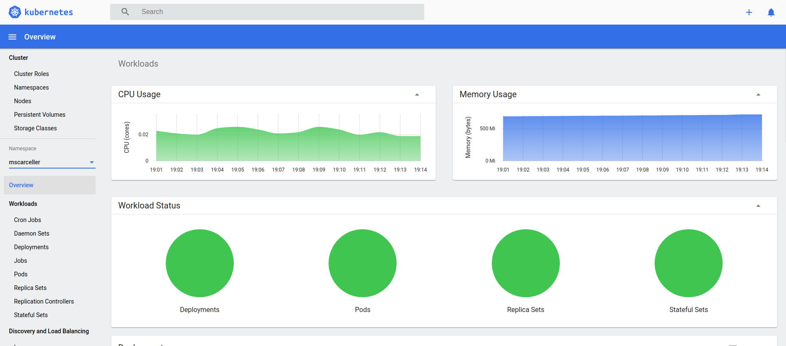

# Elastic & FaultTolerant GroupChat Application

1. [ Introduction ](#intro)
2. [ Application description ](#appdesc)
3. [ Messages Types](#messages)
4. [ Deploy Application ](#deploy)
    1. [ Deploy on local Kubernetes ](#deployk8s)
    2. [ Deploy on Okteto Cloud ](#deployOkteto)
5. [ Testing the Enviroment and Application ](#testing)

    1. [ Chaos testing with Litmus and Okteto ](#caostesting)
6. [ Appendix 1: Refererences ](#references)

<a name="intro"></a>

## 1. Introduction

This repository contains all the necessary code for deploy an elastic, fault Tolerant chat application. 
The application is based on [Vert.x](https://vertx.io/) Framework. Vert.x is an open source, reactive  software development toolkit from the developers of Eclipse.

Reactive programming is a programming paradigm, associated with asynchronous streams, which respond to any changes or events. Vert.x uses an event bus, to communicate with different parts of the application and passes events, asynchronously to handlers when they available.

The code is distributed in the following folders:

* [EFTGCA-VertxBackend](EFTGCA-VertxBackend): Elastic & FaultTolerant GroupChat Application based on Vert.x framework.

* [EFTGCA-MessagesLib](EFTGCA-MessagesLib): JavaScript library to manage messages.

* [EFTGCA-VertxAppTests](EFTGCA-VertxAppTests): JavaScript scripts used for vert.x app testing.

* [EFTGCA-Front](EFTGCA-Front): Angular front end application example.

<a name="appdesc"></a>

## 2. Application description

The basic schema of the app is:


We have an horizontal scalable group of pods with our chat app. Our server and client verticles share a vert.x event bus, and are managed inside a vert.x hazelcast cluster. 
The entry point is a load balancer that distribute the traffic over the available nodes.


- ##### Scalability

The scalability is based on ***Horizontal Pod Autoscaler*** that automatically scales the number of Pods in the application deployment, based on observed CPU utilization or on some other, application-provided metrics. The HPA is implemented as a control loop, and, during each period, the controller manager queries the resource utilization against the metrics specified in each *HorizontalPodAutoscaler* definition.

For example, in our case we have defined:

```yaml
apiVersion: autoscaling/v2beta1
kind: HorizontalPodAutoscaler
metadata:
  name: webchat-consumer
  namespace: mscarceller
spec:
  scaleTargetRef:
    apiVersion: apps/v1
    kind: Deployment
    name: webchatbackend
  minReplicas: 2
  maxReplicas: 10
  metrics:
  - type: Resource
    resource:
      name: cpu
      targetAverageUtilization: 10
```

The HPA  fetches metrics from a series of aggregated APIs (`metrics.k8s.io`, `custom.metrics.k8s.io`, and `external.metrics.k8s.io`). The `metrics.k8s.io` API is usually provided by metrics-server, which needs to be launched separately. We explain how to install and launch it on the deploy section of this document.

You can see [Horizontal Pod Autoscaler](hhttps://kubernetes.io/docs/tasks/run-application/horizontal-pod-autoscale/) for more details.


<a name="messages"></a>

## 3. Messages Types

* ### JoinRoom sequence diagram:

<p align="center">
  
</p>

* ### Text Message sequence diagram:

<p align="center">
  
</p>

* ### Error & Retry sequence diagram:

<p align="center">
  
</p>

* ### Reconnection sequence diagram:

<p align="center">
  
</p>

<a name="deploy"></a>
## 4. Deploy Application

The application is ready to be deployed. I'm going to explain how to do it  in two different ways:

- Local kubernetes cluster, based on Minikube.

- Oketo Cloud, that gives us Kubernetes namespaces to code, build, and run Kubernetes applications entirely in the cloud.

  

### 4.1 Deploy on local Kubernetes

* ####  Setting up Kubernetes with Minikube

First of all you need is a Kubernetes cluster available on your computer. In this tutorial we're going to use Minikube on Ubuntu. You can find how to install it in this link https://kubernetes.io/docs/tasks/tools/install-minikube/

Once you have minikube installed on you computer start it and check its status:

```shell
> minikube start
```

The output is similar to this:

```shell
minikube v1.11.0 en Ubuntu 18.04
Using the docker driver based on existing profile
Starting control plane node minikube in cluster minikube
Restarting existing docker container for "minikube" ...
Setting up Kubernetes v1.18.3 en Docker 19.03.2...
kubeadm.pod-network-cidr=10.244.0.0/16
Verifying Kubernetes components...
Enabled addons: dashboard, default-storageclass,
```

Then you can check minikube status:

```shell
> minikube status
```


- #### Enable Metric Server

The scalability/elasticity of the application , as mentioned in previous sections, is based on HPA,  and metrics-server monitoring needs to be deployed in the cluster to provide metrics via the resource metrics API, because HPA uses this API to collect metrics.

To install it on Minikube:

```shell
> minikube addons enable metrics-server
```

And you have an output like this:

```shell
> metrics-server was successfully enabled
```


- #### Deploy the application

Inside k8s folder type next command:

```shell
> kubectl apply -f ./full_k8s.yaml 
```

You will show an output like this:

```
namespace/mscarceller created
configmap/eftgca-backvertx-configmap created
secret/webchat-secrets created
service/mongodb created
statefulset.apps/mongodb created
ingress.extensions/webchat-ingress created
service/webchatservice created
service/webchat created
service/webchatfrontservice created
horizontalpodautoscaler.autoscaling/webchat-consumer created
deployment.apps/webchatbackend created
deployment.apps/webchatfront created
```


- #### Monitoring the resources

In order to check the status of all the components deployed inside the cluster you can use the next command:

```
> watch -n 1 kubectl get pods,services,deployments,ingress --namespace=mscarceller
```

And you'll see something like this:

```shell
NAME                                  READY   STATUS    RESTARTS   AGE
pod/mongodb-0                         1/1     Running   0          75s
pod/webchatbackend-5579777b5c-lxz8f   1/1     Running   0          60s
pod/webchatbackend-5579777b5c-p8ndk   1/1     Running   0          75s
pod/webchatfront-7d74fc46c4-qgm87     1/1     Running   0          75s

NAME                          TYPE           CLUSTER-IP      EXTERNAL-IP   PORT(S)          AGE
service/mongodb               ClusterIP      None            <none>        <none>           75s
service/webchat               LoadBalancer   10.97.123.130   <pending>     8080:31737/TCP   75s
service/webchatfrontservice   LoadBalancer   10.105.8.77     <pending>     8081:32057/TCP   75s
service/webchatservice        ClusterIP      None            <none>        5701/TCP         75s

NAME                             READY   UP-TO-DATE   AVAILABLE   AGE
deployment.apps/webchatbackend   2/2     2            2           75s
deployment.apps/webchatfront     1/1     1            1           75s

NAME                                 CLASS    HOSTS                                  ADDRESS      PORTS   AGE
ingress.extensions/webchat-ingress   <none>   webchat-mscarceller.cloud.okteto.net   172.17.0.2   80      75s
```


- #### Checking Metric-Server

To check if the metric server is measuring correctly our resources you can obtain its details:

```
> kubectl describe hpa webchat-consumer --namespace=mscarceller
```

The output:

```
Name:                                                  webchat-consumer
Namespace:                                             mscarceller
Labels:                                                <none>
Annotations:                                           CreationTimestamp:  Fri, 09 Oct 2020 18:35:18 +0200
Reference:                                             Deployment/webchatbackend
Metrics:                                               ( current / target )
  resource cpu on pods  (as a percentage of request):  5% (10m) / 75%
Min replicas:                                          2
Max replicas:                                          10
Deployment pods:                                       2 current / 2 desired
Conditions:
  Type            Status  Reason            Message

----            ------  ------            -------

  AbleToScale     True    ReadyForNewScale  recommended size matches current size
  ScalingActive   True    ValidMetricFound  the HPA was able to successfully calculate a replica count from cpu resource utilization (percentage of request)
  ScalingLimited  True    TooFewReplicas    the desired replica count is less than the minimum replica count
Events:
  Type     Reason                        Age                From                       Message

----     ------                        ----               ----                       -------

  Normal   SuccessfulRescale             19m                horizontal-pod-autoscaler  New size: 2; reason: Current number of replicas below Spec.MinReplicas
```


- #### Using the Kubernetes Dashboard

To access the [Kubernetes Dashboard](https://kubernetes.io/docs/tasks/access-application-cluster/web-ui-dashboard/), run this commands in a shell after starting Minikube to install the addon and get the address:

Install the dashboard Addon:

```
> minikube dashboard
```

Get the address:

```shell
> minikube dashboard
Verifying dashboard health ...
🚀  Launching proxy ...
🤔  Verifying proxy health ...
🎉  Opening http://127.0.0.1:46399/api/v1/namespaces/kubernetes-dashboard/services/http:kubernetes-dashboard:/proxy/ in your default browser...
```

it will launch the browser:



**NOTE**: to get the access token you can use this command:

```
> kubectl -n kube-system describe secret $(kubectl -n kube-system get secret | awk '/^deployment-controller-token-/{print $1}') | awk '$1=="token:"{print $2}'
```


- #### Edit the Local Hosts File

When you type a domain name in your browser to go to a website, your computer translates the domain name your typed into an IP address and connect to the server that hosts the website. We have deploy an Ingress Service, so to access the application in our browser we need to configure the local host file to redirect the traffic to our minikube cluster.

The definition of our ingress service is:

```yaml
apiVersion: extensions/v1beta1
kind: Ingress
metadata:
  name: webchat-ingress
  namespace: mscarceller
  annotations:
    kubernetes.io/ingress.class: "nginx"
spec:
  rules:
  - host: webchat-mscarceller.cloud.okteto.net
    http:
      paths:
        - path: /
          backend:
            serviceName: webchatfrontservice      
            servicePort: 8081
        - path: /chat
          backend:
            serviceName: webchat      
            servicePort: 8080
```

We need to redirect *webchat-mscarceller.cloud.okteto.net* traffic to the ip of our ingress service exposed by minikube

First get the ingress IP:

```
> watch -n 1 kubectl get ingress --namespace=mscarceller
```

We get something like this:

```
NAME              CLASS    HOSTS                                  ADDRESS      PORTS   AGE
webchat-ingress   <none>   webchat-mscarceller.cloud.okteto.net   172.17.0.2   80      50m
```

So we need to edit our our Hosts file:

```
> sudo nano /etc/hosts
```

A similar lines below should appear in the file.

```
127.0.0.1       localhost
127.0.1.1       migle-portatil

# The following lines are desirable for IPv6 capable hosts
::1     ip6-localhost ip6-loopback
fe00::0 ip6-localnet
ff00::0 ip6-mcastprefix
ff02::1 ip6-allnodes
ff02::2 ip6-allrouters
```

We have to add next line:

```
172.17.0.2      webchat-mscarceller.cloud.okteto.net
```

Save the file. Changes you make to the hosts file take effect immediately.

Now you can open the application on browser.

### 4.2 Deploy on Okteto Cloud


<a name="testing"></a>
## 5. Testing the Enviroment and Application

<a name="caostesting"></a>
### 5.1 Chaos testing with Litmus and Okteto

You can see more detalis [here](./Documentation/ChaosTestingOkteto.md)


## 6. Appendix 1: References


- Horizontal Pod Autoscaler: https://kubernetes.io/docs/tasks/run-application/horizontal-pod-autoscale-walkthrough
- Metric Server https://github.com/kubernetes-incubator/metrics-server/