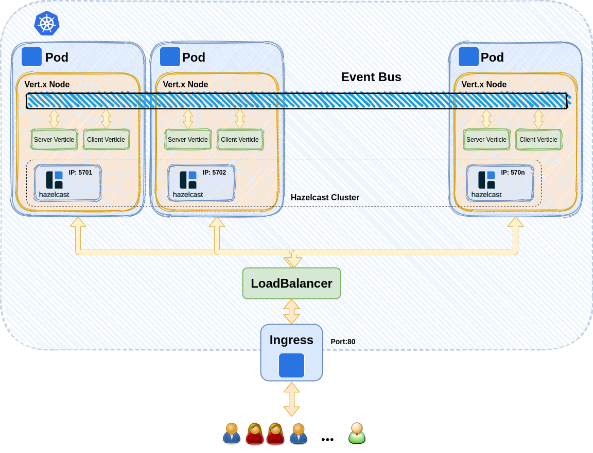

# Elastic & Fault Tolerant GroupChat Application

1. [ Introduction ](#intro)
2. [ Getting Started ](#gettingstarted) 
3. [ Testing the application ](#testing)

## **1. Introduction**

This repository contains all the necessary code for deploy an elastic and fault tolerant chat application. These are the basis and the two principal characteristics of the application. 

The application offers the possibility of exchanging messages between several users inside a room. Basically the users can log into a chat room, send and receive text messages.

The client try to connect to a websocket exposed by our application and, when the connection is established, the user can join a room and start chatting with the other users in room.

The code is distributed in the following folders:

* [EFTGCA-VertxBackend](EFTGCA-VertxBackend): Elastic & Fault Tolerant GroupChat Application based on Vert.x framework.

* [EFTGCA-MessagesLib](EFTGCA-MessagesLib): JavaScript library to manage messages.

* [EFTGCA-VertxAppTests](EFTGCA-VertxAppTests): JavaScript scripts used for Vert.x app testing.

* [EFTGCA-Front](EFTGCA-Front): Angular front end application example.

- #### Based on Kubernetes:

The application has been developed to be deploy and run inside Kubernetes clusters. Kubernetes is a compute platform for the automated deployment, scaling, and management of containerized applications across any infrastructure.

The application is based on [Vert.x](https://vertx.io/) Framework, an open source, reactive software development toolkit from the developers of Eclipse. Reactive programming is a programming paradigm, associated with asynchronous streams, which respond to any changes or events. Vert.x uses an event bus, to communicate with different parts of the application and passes events, asynchronously to handlers when they available.

The basic schema is:

We have an horizontal scalable group of pods with our chat application. Our server and client Verticles share a Vert.x event bus, and are managed inside a Vert.x Hazelcast cluster. 

The entry point is a load balancer that distribute the traffic over the available nodes.

- #### Elasticity:

**Elasticity** is the ability to grow or shrink infrastructure resources dynamically as needed to adapt to workload changes in order to  maximizing the use of resources. 

Because  application is deployed on Kubernetes we have the ability to adapt our resources by using the ***Horizontal Pod Autoescaler*** (shortened to HPA), that automatically scales the number of Pods in the application deployment, based on observed CPU utilization or on some other application-provided metrics. The HPA is implemented as a control loop, and, during each period, the controller manager queries the resource utilization against the metrics specified in each **HorizontalPodAutoscaler** definition.

As many resources are needed the system deploy new nodes with the application, and, when the load decrease, the system release this resources.

The HPA fetches metrics from a series of aggregated APIs (`metrics.k8s.io`, `custom.metrics.k8s.io`, and `external.metrics.k8s.io`). The `metrics.k8s.io` API is usually provided by metrics-server, which needs to be launched separately. We explain how to install and launch it on the deploy section of this document.

You can see [Horizontal Pod Autoscaler](hhttps://kubernetes.io/docs/tasks/run-application/horizontal-pod-autoscale/) for more details.

- #### Fault Tolerant:

**Fault tolerance** is the property that enables the application to continue operating properly even if one or more of its components fail. Because Pods represent processes running on nodes in the cluster, our chat application in this case, it is important to allow those processes to gracefully terminate when they are no longer needed. Kubernetes provides Containers with lifecycle hooks.

Kubernetes waits for a specified time called the termination grace period before shutdown and release the pod, and during this time our application notify the users and request them to reconnect. When users receive this notification they must send a reconnect message in order to be connected to a new container. Here the load balancer send the user traffic to a different pod, never to the pod that is shutting down

When the application fails and the client get a disconnect event from the websocket it can try to reconnect, and the request will be sent to an available application node.

You can find a full description of the application in the [EFTGCA-VertxBackend](https://github.com/MasterCloudApps-Projects/ElasticFaultTolerant-GroupChat/tree/master/EFTGCA-VertxBackend) folder.

---

## **2. Getting Started**

Please, visit the [Getting Started](./Documents/GettingStarted.md) document

---

## 3. Testing the application

Please, visit the [Chaos Testing with Litmus and Okteto Cloud](https://github.com/MasterCloudApps-Projects/ElasticFaultTolerant-GroupChat/blob/master/Documents/ChaosTestingOkteto.md) document or visit the wiki.

You can find some test examples of testing scripts in the [EFTGCA-VertxAppTests](https://github.com/MasterCloudApps-Projects/ElasticFaultTolerant-GroupChat/tree/master/EFTGCA-VertxAppTests) project.

 

