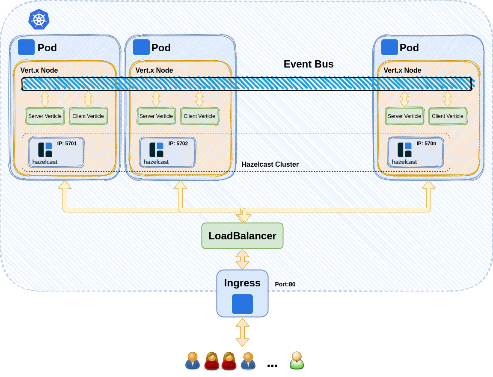
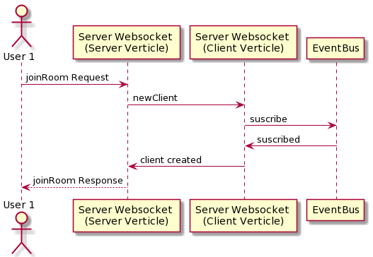
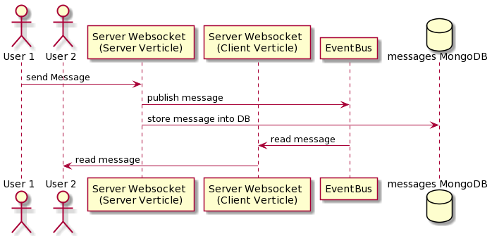
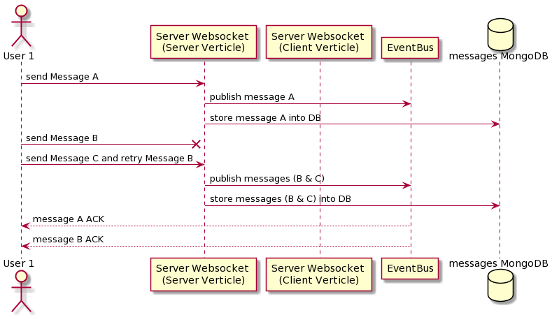

# Elastic & FaultTolerant GroupChat Application

1. [ Introduction ](#intro)
2. [ Application description ](#appdesc)
3. [ Messages ](#messages)
4. [ Deploy full Chat Application instance](#deploy)
5. [ Testing the Enviroment and Application ](#testing)
    1. [ Chaos testing with Litmus and Okteto ](#caostesting)

## 1. Introduction

This repo contains all the necesary code for deploy an elastic, faultTolerant chat application. 
The app is based on [Vert.x](https://vertx.io/) Framework. Vert.x is an open source, reactive  software development toolkit from the developers of Eclipse.

Reactive programming is a programming paradigm, associated with asynchronous streams, which respond to any changes or events. Vert.x uses an event bus, to communicate with different parts of the application and passes events, asynchronously to handlers when they available.

The code is distributed in the following folders:

* [EFTGCA-VertxBackend](EFTGCA-VertxBackend): Elastic & FaultTolerant GroupChat Application based on Vert.x framework.

* [EFTGCA-MessagesLib](EFTGCA-MessagesLib): Javascript library to manage messages.

* [EFTGCA-VertxAppTests](EFTGCA-VertxAppTests): Javascript scripts used for vert.x app testing.

* [EFTGCA-Front](EFTGCA-Front): Angular frontend app example.

## 2. Application description

The basic schema of the app is:

We have an horizontal scalable group of pods with our chat app. Our server and client verticles share a vert.x event bus, and are managed inside a vert.x hazelcast cluster. 
The entry point is a load balancer that distribute the traffic over the available nodes.

## 3. Messages

* ### JoinRoom sequence diagram:

* ### Text Message sequence diagram:

* ### Error & Retry sequence diagram:

* ### Reconnection sequence diagram:

## 4. Testing the Enviroment and Application

### 4.1 Chaos testing with Litmus and Okteto

You can see more detalis [here](./Documentation/ChaosTestingOkteto.md)
